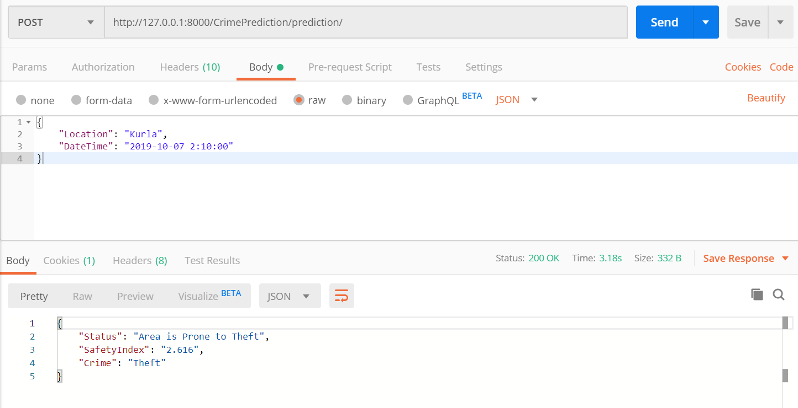
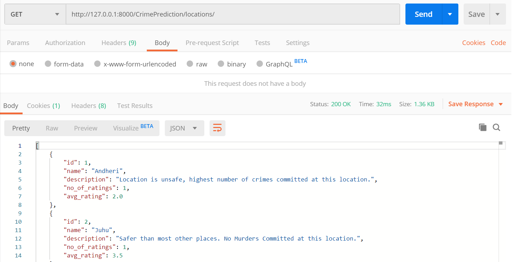
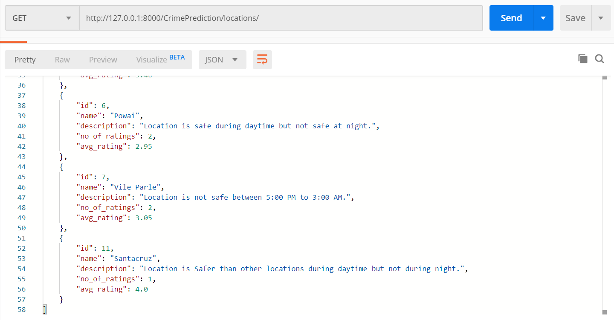

# SafetyApp_Backend

This repository features the <b>Backend</b> of the <b>"SafetyApp_Mobile"</b> application [Check Here](https://github.com/sourabbanka22/SafetyApp_Mobile)  which was developed using React-Native.
This application uses Django to develop a REST API backend with an integrated cutting edge tech <b>"Machine Learning"</b> to predict results based on the DateTime and Location input provided. Although the trained model is directly included inside the models folder 
inside this repository. The MachineLearning models have been trained seperately and pickled to generate a trained model
which is a binary file with .pkl extension.

Thus Developing this application involved 3 steps:
- Training the ML model
- Building the django application
- Testing the API

There are 2 models trained one a <b>Regression model</b> and another the <b>Classification</b> model. The Regression model is used
to predict the SafetyIndex value which is continuous and Classification model is used to predict the type of crime 
in the particular location.

## Following image gives the overview of how the request to the API and fetching of the results work here:

  

This django application also has its respective models and viewsets for location and rating developed which renders the requested
values to the user at the respective URL.

## Following image gives the overview of how the data of the locations is stored in the respective models here:

  

  

The above results are only visible to an <b>Authenticated User</b> who is registered with the application. The authorized user has to pass his/her respective <b>Authorization Token</b> with each request to the server to view the results.
